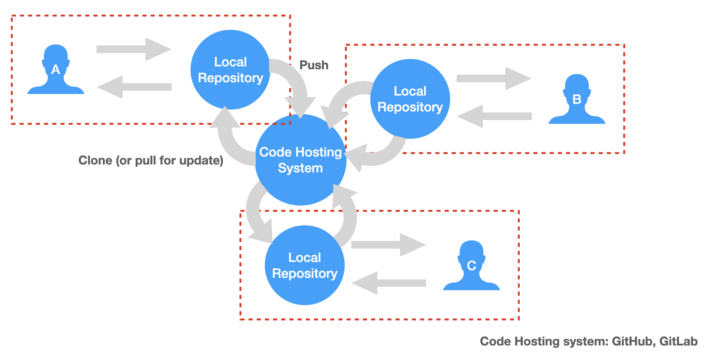

# Git 資料流

## Git 常與其他框架一起使用
* CI/CD
	* Jenkins
	* Travis CI
* 套件管理
	* npm
	* pip composer
* 基礎架構軟體
	* Ansible
	* Docker
* markdow管理
	* GitBook

## 會與 git 一起用到的terminal 指令
### 工作目錄名稱(working directory name): pwd
### 顯示工作目錄底下的內容(list directory contents): ls
* 顯示詳細資訊: ls -l
* 顯示詳細資訊(易讀模式): ls -lh
* 顯示隱藏檔案: ls -a
* 一檔案大小排序: ls -s

### 切換目錄: cd
### 查詢指令: man [command]
輸入完後會進到指令說明頁面，按一下 q 就可以退出說明頁面
### 清除畫面上指令: clear
### 新增檔案: touch [file name]
### 刪除檔案: rm [file name]
### 複製檔案: cp [file name] [new file name]
### 複製目錄: cp -R [directory name] [new directory]
### 移動檔案: mv [file name] [directory]
### 改檔案名稱: mv [file name] [new fßile name]
### 建立資料夾: mkdir [directory]
### 查看文字檔案內容: cat [file name]
### 快捷鍵
* 自動補齊: tab