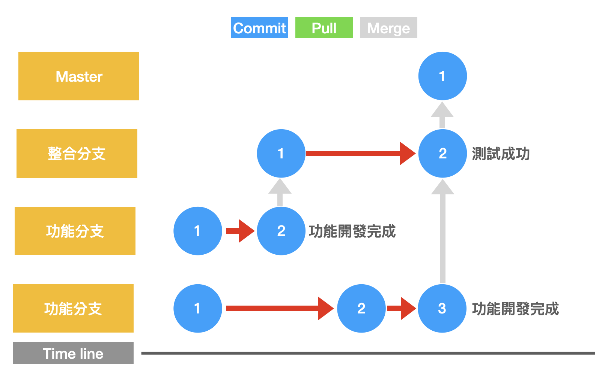
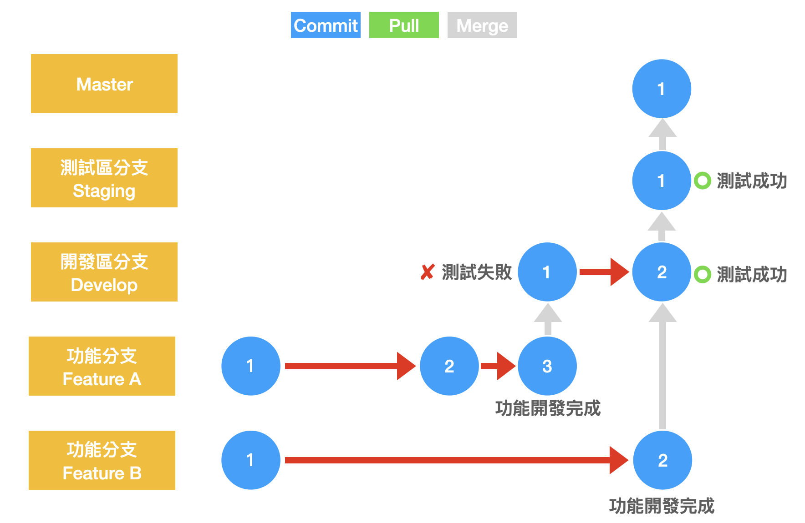
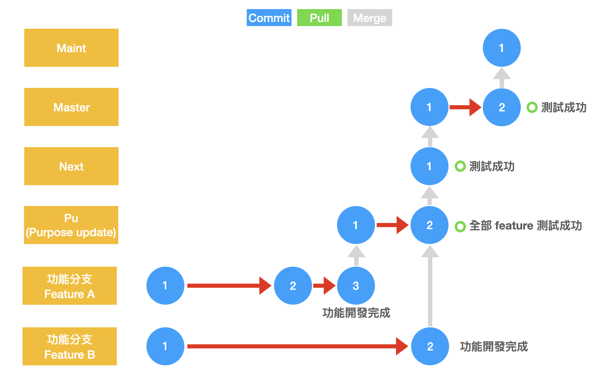
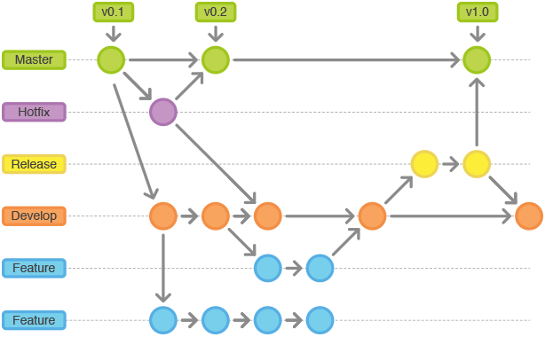

# 分支管理策略
開發時應該麼管理分支
## 主線開發

* 最容易理解
* 最簡單
* 所有開發者持續將成果合併到單一分支
* 維持分支能夠部署的狀態

## 主線搭配分支開發(通常用在網站開發)

* 專案變大的必經之路
* 開發者變多：依照開發者開分支
* 有成果後將分支合併至主線
* 主線使用CI/CD交付整合結果
* 優點：
	* 不會有過多分支難以維護
	* 主線都可以部署，較不會發生緊急修正
* 缺點：
	* 若無測試基礎，出錯機率變高
	* 持續部署頻繁，較適用在自動更新情境

## 一功能一分支(滿常用的)
Just like GitHub flow

* 新功能開心分支
* 盡量讓分支不要太大
* 功能完成後合併到整合分支
* 建制主管選擇要整合的功能為何
* 整合分支測試完後再合併 master
* 優點：
	* 類似主線開發，方便快速部署
	* 可以選擇想要的功能整合
* 缺點：
	* 功能完成後若沒有馬上合併，會花額外心力維持分支一致性
	* 分支命名原則提高菜鳥負擔
	* 功能分支合併到主線後，開發者要刪除分支

	
## GitLab Flow

* 倒導入開發位置的概念
* 透過命名慣例表目前程式位置
* 應該搭配 SemVer 使用
* 適用於無法控制發佈或合併時間的專案

## gitworkflows Flow (git 這個程式就是用此種方法開發)

* pu: 目前還不適合發行的功能
* next: 實驗中的功能，會影響 master 的穩定性
* master: 準備進入下一次發佈
* maint: 最新穩定版

---
### GitLab Flow & gitworkflows
* 優點
	- 分支名稱符合情境
	- 合併進度時更易使用正確分支

* 缺點
	- 必須要有指南才能知道從哪個分支(next or master)開始開發
	- 分支名稱與情境有高度相關，很難在不同專案建立一樣的結構 

---

## GitFlow
[Reference](https://lrtitecnologia.wordpress.com/gitflow/)

* master(上線)：永遠處於可以使用的狀態
* develop (開發)：發布前都從這裡建立分支
* feture(功能)：開發新功能都從 develop 建立分支出來，完成後合併回 develop
* release(發佈)：發佈前的所有測試 ; 若有 bug 則在此修正，從 develop 分支出來，完成後合併回 master 及 develop 分支
* hotfix(緊急修復)：上線後需緊急修復的 bug ，從 master 建立分支出來，完成後合併回master 及 develop

* 優點
	- 不需初期建立完整的測試基礎
	- 遵守慣例就能應用
	- 適合需要分版本的專案

* 缺點
	- 若不熟悉產品開發會有很大的負擔
	- 用錯分支很難回復
	- 無法持續部署