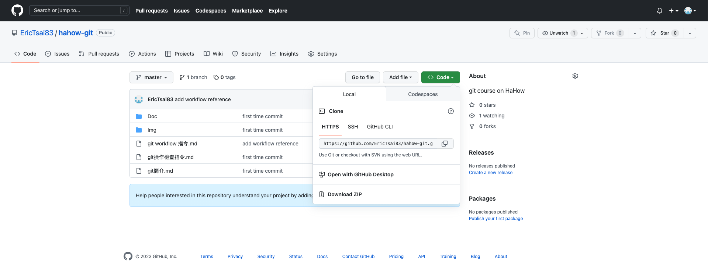

## 前置作業
用 homebrew 安裝 tmux，並確保 homemade 的 terminal 程式，有存在專案中 bin 資料夾下
## 1. 變更工作目錄
`cd ./computer-science/hahow-git`

## 2. 要使用 git-tree command ，需用底下語法加入環境變數
`export PATH=$PATH:/Users/eric/computer-science/hahow-git/bin`

## 3. 忽略不想被 Git 保管的檔案
[gitignore](https://www.toptal.com/developers/gitignore)


## Case 1. 推送本地端已存在的專案到雲端儲存庫
## 1-1. 先在 github 建一個repository
建完後的頁面會出現 git 的參考語法
## 1-2.  新增要檢視的遠端版本庫
`git remote add origin https://github.com/[github uesr name]/[repository name].git`

```
可以指定 -v 選項來顯示 Git 用來讀寫遠端簡稱時所用的網址
git remote -v
```
## 1-3. 查看有沒有新增成功
`git remote show origin`
## 1-4. 將本地端的專案推送上去
`git push -u origin master`
## 1-5. 輸入帳號密碼
帳號為GitHub 帳號，密碼為 GitHub 的 Personal access tokens 

## Case 2. 首次下載雲端儲存庫到本地端

`git clone https://github.com/[github uesr name]/[repository name].git`

## Case 3. 從遠端儲存庫下載最新的資料到本地儲存庫，並且將本地儲存庫的資料取出到工作目錄
`git pull`

```
從 case2 和 case3 可以知道
git pull 等同於先用 git fetch 再用 git pull
```
## Case 4. 從遠端儲存庫下載最新的資料到本地儲存庫(不直接更新工作目錄)
`git fetch`

## Case 5. 新建了一個本地端的檔案，並透過 git 上傳到雲端儲存庫，可以用
1. `git add .`
2. `git commit -m '我是註解'`
3. `git push`
