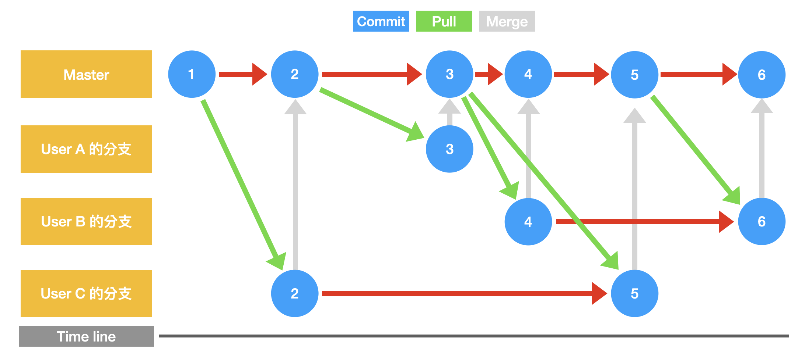

# 開發模型
## 主線開發

* 最容易理解
* 最簡單
* 所有開發者持續將成果合併到單一分支
* 維持分支能夠部署的狀態

## 主線搭配分支開發

* 專案變大的必經之路
* 開發者變多：依照開發者開分支
* 有成果後將分支合併至主線
* 主線使用CI/CD交付整合結果
* 優點：
	* 不會有過多分支難以維護
	* 主線都可以部署，較不會發生緊急修正
* 缺點：
	* 若無測試基礎，出錯機率變高
	* 持續部署頻繁，較適用在自動更新情境
